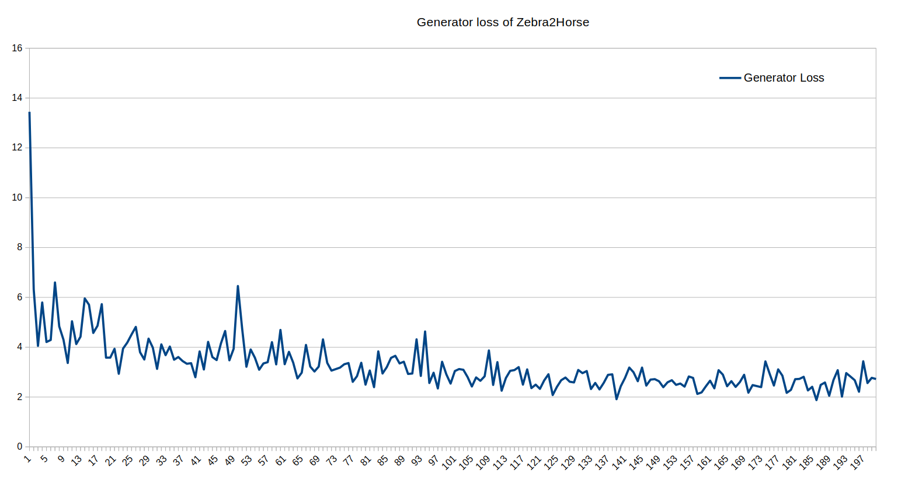
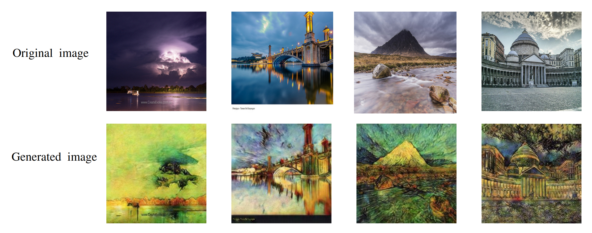
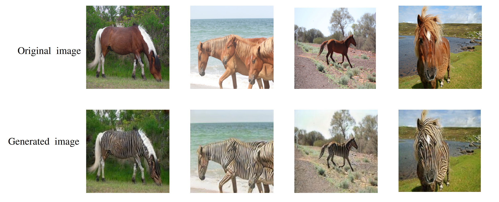

# CycleGAN Implementation Documentation

## Overview

This documentation covers the implementation of CycleGAN, a model capable of image-to-image translation using unpaired datasets. CycleGAN can be used for various tasks such as style transfer, object transfiguration, season transfer, and photo enhancement.

## Requirements

- Python 3.x
- PyTorch
- Download dataset in ./datasets/horse2zebra or ./datasets/vangogh2photo

## Train


To train the CycleGAN model, run the `train.py` script with the desired arguments. Examples of how to run the script:

```bash
python train.py --datatype 'z2h' --lr_g 0.0001 --lr_d 0.0001 --lamnda_X2Y 10 --lamnda_Y2X 10 --epochs 100 --lr_decay_iters 50 --lambda_idt 0
```

### Parameters

- `datatype`: Type of dataset (e.g., 'van' for vangogh2photo, 'z2h' for zebra to horse).
- `g_input_nc`: Number of input channels for generator.
- `g_output_nc`: Number of output channels for generator.
- `d_input_nc`: Number of input channels for discriminator.
- `lr_g`: Learning rate for generator.
- `lr_d`: Learning rate for discriminator.
- `device`: Device to train on ('cuda' or 'cpu').
- `lamnda_X2Y`: Lambda value for X to Y cycle consistency.
- `lamnda_Y2X`: Lambda value for Y to X cycle consistency.
- `epochs`: Number of training epochs.
- `batch_size`: Batch size for training.
- `lr_decay_iters`: Epoch at which to start learning rate decay.
- `reduction`: Reduction method.
- `lambda_idt`: Identity lambda value.

### Training Process

The training process involves:

- Data loading and preprocessing.
- Setting up the CycleGAN model.
- Iterating over the dataset for the specified number of epochs.
- Training the model and saving the best models.
- Generating and saving images at each epoch.
- Logging the training losses and plotting them.

### Output

The script will create a unique experiment folder named `./experiments_<datatype>/1,2,3...` etc., to store:

- Model checkpoints (`models` folder).
- Generated images (`images_result` folder).
- Training options (`options.json`).
- Loss graphs (`loss.png`).
- Loss values (`losses.csv`).




---

## Image Generation

### Overview

This script generate.py is used for generating images using a trained CycleGAN model. It processes images from a specified directory and applies the model to generate transformed images.


## Usage

Run the `generate.py` script with the necessary arguments. Here is an example command:

```bash
python generate.py --root './experiments_van/1/' --model_name 'V_Y2X.pth' --image_dirc 'vangogh2photo/trainB/'
```

## Example



